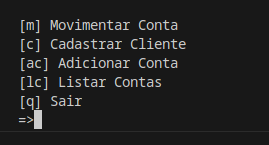
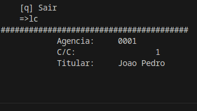
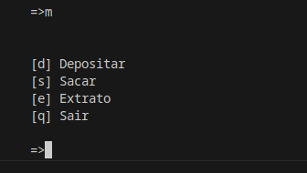
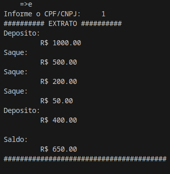

<h1>
    
    Formação Python Developer
</h1>

# :computer: Desafio de projeto: 

## Modelando o Sistema Bancário em POO com Python

Esse desafio é uma evolução do desafio de sistemas bancários usando funções. Aqui se utilizam classes para definir os clientes, contas e transações.

# :bulb: Solução do desafio

A solução se encontra no arquivo sistemaBancario.py, o arquivo está comentado e o cliente interage via terminal.

- deve ser executada em um terminal  
$python sistemaBancario.py

Foram definidas as operações de cadastrar os clientes, adicionar conta, saque, deposito e extrato. 
Para criar uma conta é necessário primeiro adicionar o usuário e então criar adicionar a conta com o CPF do usuário cadastrado.

Eu dividi os menus, no princial temos as operações de cadastrar clientes, adicionar contas e listar contas: 

O cadastro de cliente está OK.

No segundo menu se tem as movimentações da conta:

Os operações estão OK.

Os dados não são salvos no disco.
